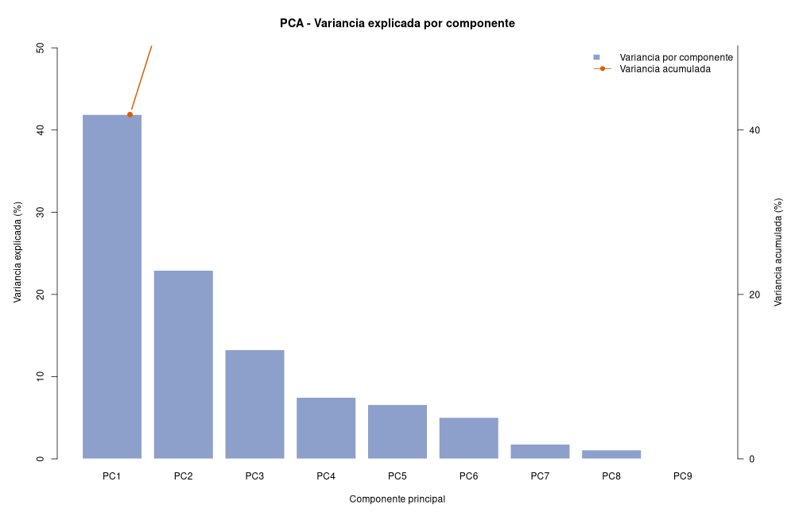
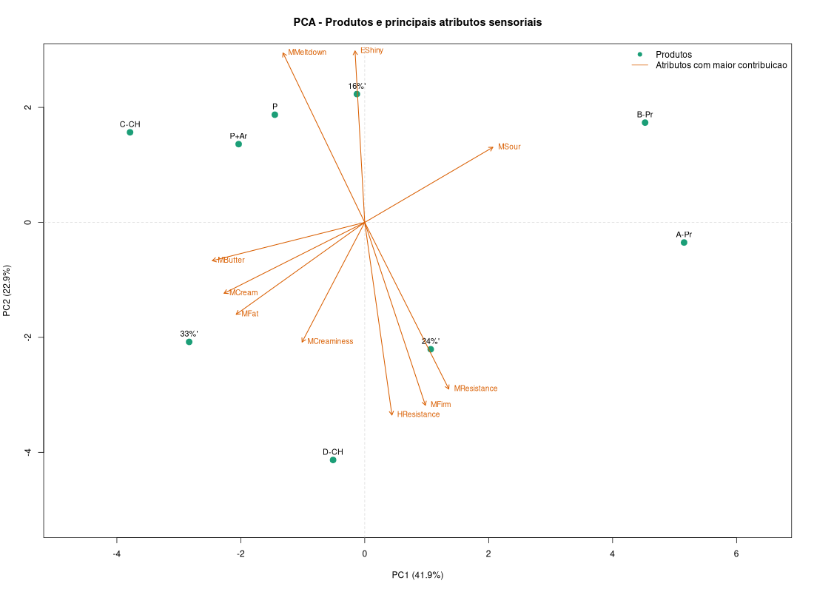
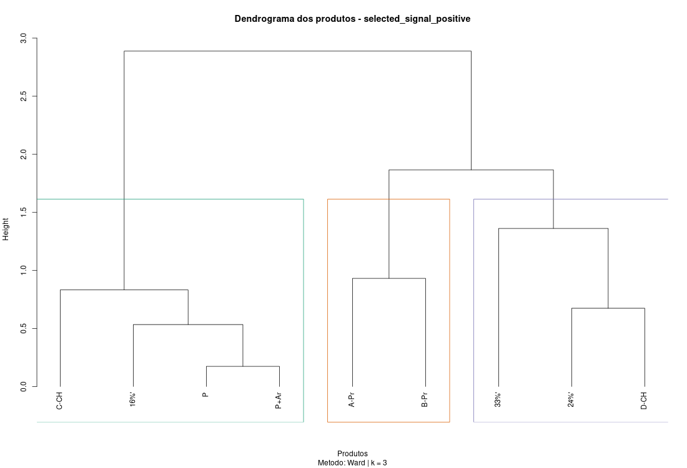
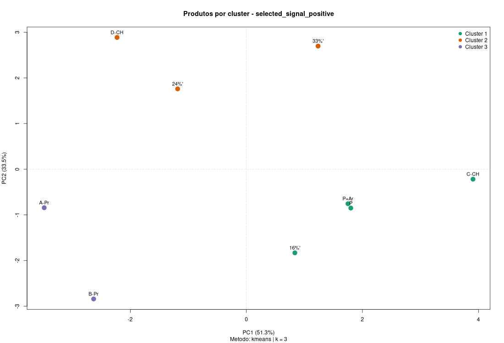
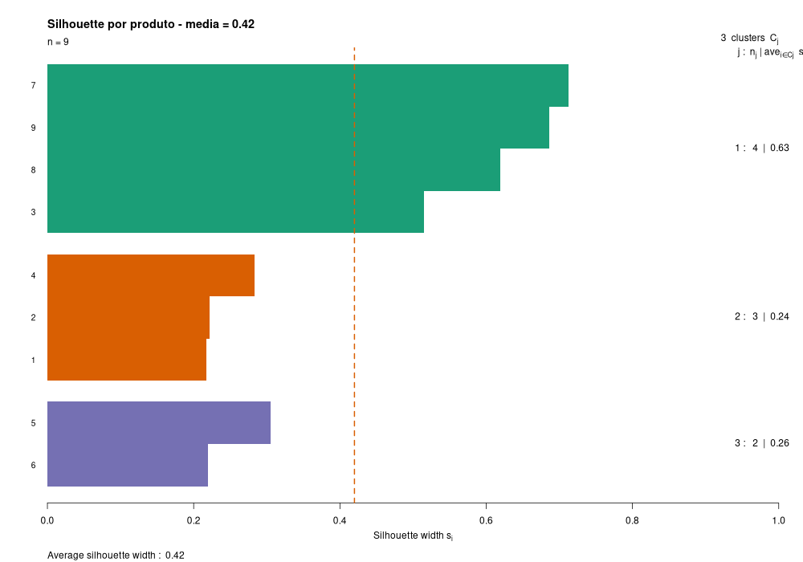
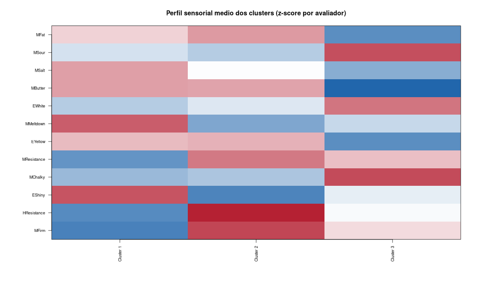
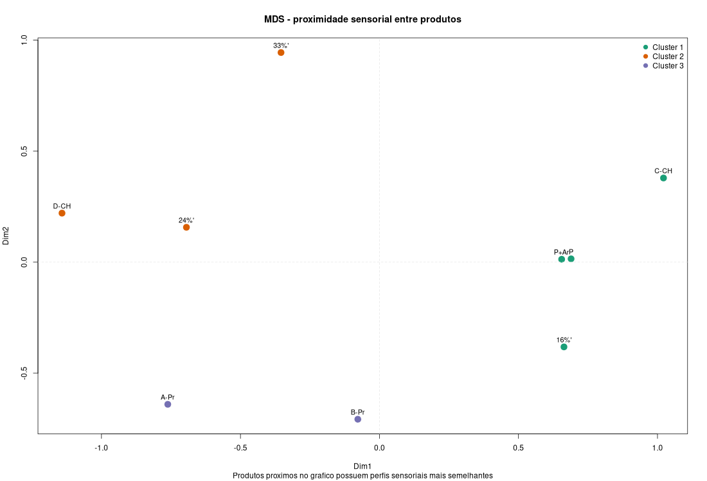
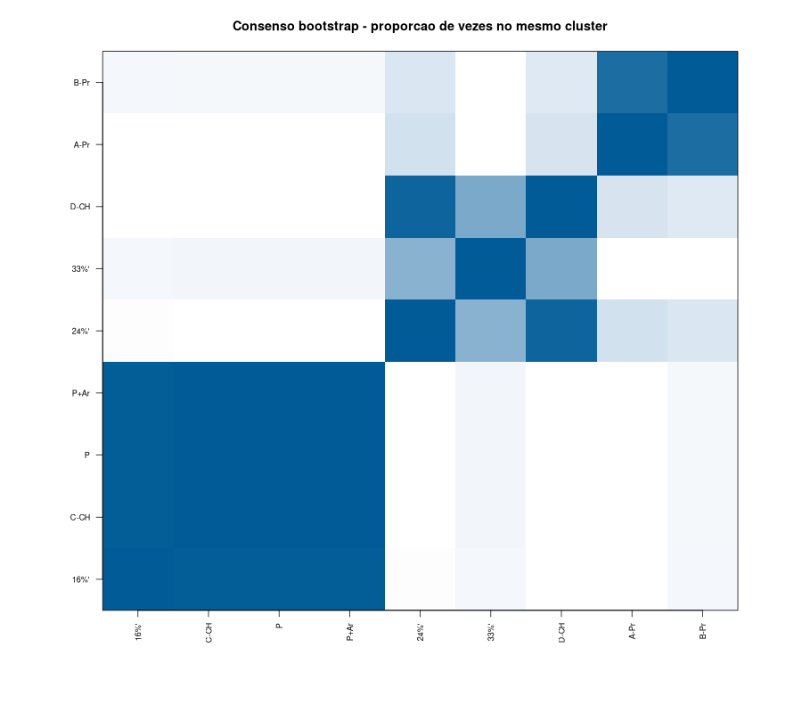
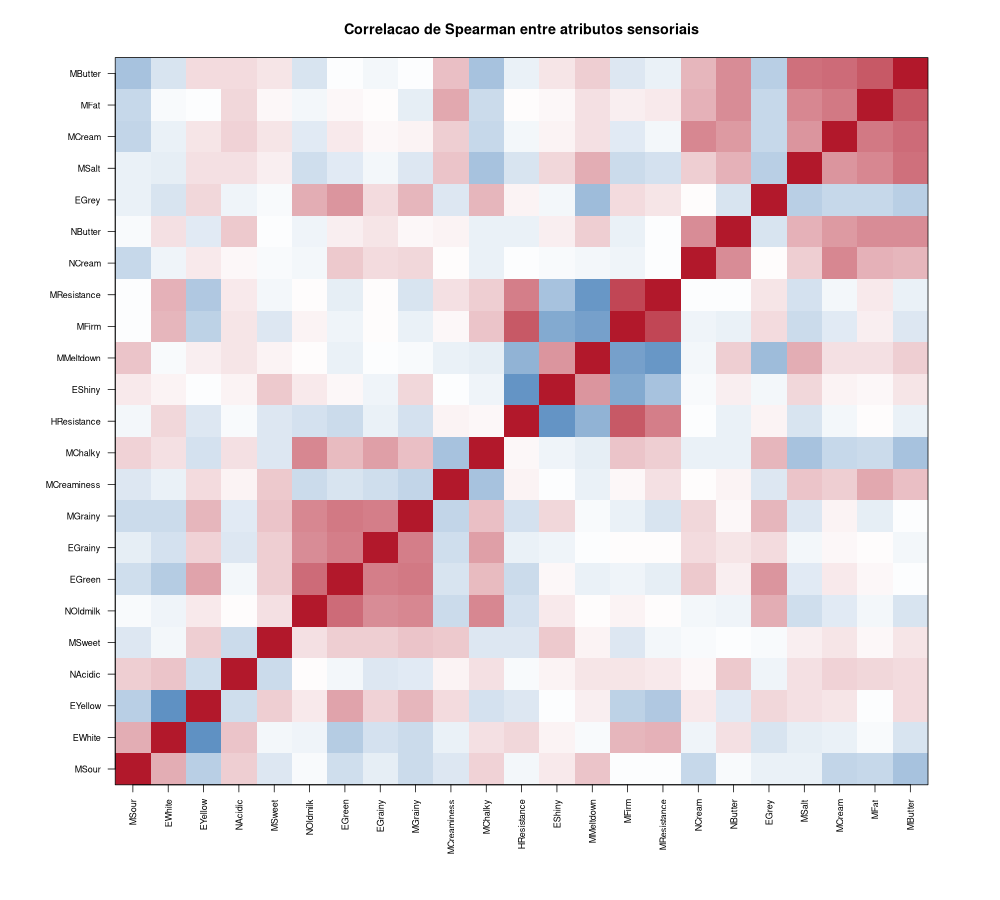

# Relatorio de Analise Exploratoria - Cream Cheese

## 1. Contexto da base

Este projeto analisa uma base sensorial de produtos do tipo cream cheese. Os dados
originais estao no arquivo SPSS:

```text
SPSS_CreamCheese/SPSS- for CreamCheese/CreamCheeseRawData2000.sav
```

A base contem avaliacoes feitas por avaliadores do painel sensorial sobre diferentes produtos. Cada
linha representa uma avaliacao experimental, identificada por produto,
avaliador do painel sensorial, repeticao, sessao e ordem de servico.

Variaveis de identificacao:

- `Productname`: nome/codigo do produto.
- `Productnumber`: codigo numerico do produto.
- `Panellist`: avaliador do painel sensorial.
- `Replicate`: repeticao experimental.
- `Session`: sessao.
- `Servingorder`: ordem de apresentacao.

Variaveis sensoriais analisadas:

```text
NCream, NAcidic, NButter, NOldmilk,
EWhite, EGrey, EYellow, EGreen,
HResistance,
EGrainy, EShiny,
MFirm, MMeltdown, MResistance, MCreaminess, MGrainy, MChalky,
MCream, MFat, MButter, MSalt, MSour, MSweet
```

Apos a leitura e limpeza, a base ficou com:

```text
240 linhas
29 colunas
23 atributos sensoriais
9 produtos
8 avaliadores do painel sensorial
```

## 2. Tipo de analise realizada

A analise realizada foi uma **analise exploratoria nao supervisionada**. Nao foi
utilizada regressao nem classificacao, pois a base nao possui uma variavel-alvo
definida para predicao e a proposta do trabalho e explorar a estrutura sensorial
dos produtos.

O objetivo principal foi:

- entender a qualidade e estrutura da base;
- identificar os atributos sensoriais mais informativos;
- reduzir redundancia e ruido;
- explorar a proximidade entre produtos;
- formar grupos de produtos com perfis sensoriais semelhantes;
- avaliar se os agrupamentos encontrados sao interpretaveis e estaveis.

As tecnicas principais foram:

- limpeza e validacao dos dados;
- padronizacao por avaliador do painel sensorial;
- selecao exploratoria de variaveis;
- PCA;
- clusterizacao com `kmeans`, `pam` e `hclust`;
- validacao com metricas internas;
- estabilidade por bootstrap;
- MDS para visualizacao de proximidade.

## 3. Limpeza e preparacao dos dados

A limpeza foi feita no arquivo [script.R](script.R). Os principais passos foram:

1. Leitura do arquivo SPSS com o pacote `foreign`.
2. Verificacao das colunas obrigatorias.
3. Padronizacao de `Productname`, removendo espacos extras.
4. Conversao dos identificadores numericos.
5. Conversao dos atributos sensoriais para numerico.
6. Verificacao de duplicatas.
7. Validacao das faixas esperadas dos IDs experimentais.
8. Imputacao robusta, caso houvesse valores ausentes.
9. Winsorizacao nos percentis 1% e 99% para reduzir impacto de extremos.
10. Tipagem final dos identificadores.

Resumo da qualidade dos dados:

| Metrica | Valor |
|---|---:|
| Linhas antes da limpeza | 240 |
| Linhas apos a limpeza | 240 |
| Duplicatas exatas removidas | 0 |
| Duplicatas no desenho experimental | 0 |
| Missing antes | 0 |
| Missing depois | 0 |
| Erros de coercao numerica | 0 |
| Valores baixos winsorizados | 54 |
| Valores altos winsorizados | 60 |

Os IDs experimentais tambem foram validados:

| Variavel | IDs invalidos |
|---|---:|
| Panellist | 0 |
| Replicate | 0 |
| Session | 0 |
| Servingorder | 0 |

Observacao importante: o produto `A-Pr` aparece associado a mais de um
`Productnumber`. O script reporta essa inconsistencia, mas preserva o produto
na analise. O `Productnumber` foi mantido como inteiro e usado para ordenacao.

## 4. Preparacao sensorial

Como os dados sao sensoriais e dependem dos avaliadores do painel sensorial, foi
criada uma versao padronizada por avaliador. Para cada atributo sensorial, o
script calcula um z-score dentro de cada avaliador:

```text
valor corrigido = (valor - media do avaliador) / desvio-padrao do avaliador
```

Essa etapa reduz o efeito de avaliadores que usam escalas mais altas ou mais
baixas, deixando a comparacao entre produtos mais justa.

Foram gerados dois perfis medios por produto:

- `outputs/product_profile_raw.csv`: perfil bruto medio por produto.
- `outputs/product_profile_panelist_z.csv`: perfil corrigido por avaliador do painel sensorial.

## 5. Selecao exploratoria de variaveis

A selecao de variaveis foi feita sem usar variavel-alvo, classificacao ou
regressao preditiva. A ideia foi selecionar atributos que diferenciam produtos
de forma consistente.

Para cada atributo sensorial, o script avaliou:

- variabilidade geral (`sd`, `IQR`, numero de valores distintos);
- efeito do produto (`eta_product`);
- efeito do avaliador do painel sensorial (`eta_panelist`);
- interacao produto:avaliador do painel sensorial (`eta_interaction`);
- escore de sinal sensorial:

```text
signal_score = eta_product - eta_interaction
```

Assim, um atributo recebe maior peso quando diferencia produtos e menor peso
quando a diferenca depende demais do avaliador do painel sensorial.

Tambem foi verificada redundancia entre atributos por correlacao de Spearman.
O cenario final escolhido foi:

```text
selected_signal_positive
```

Esse cenario manteve somente atributos com sinal positivo real:

```text
MFirm, HResistance, EShiny, MChalky, MResistance, EYellow,
MMeltdown, EWhite, MButter, MSalt, MSour, MFat
```

Os arquivos principais dessa etapa sao:

- `outputs/variable_selection_attribute_ranking.csv`
- `outputs/variable_selection_scenarios.csv`

## 6. PCA

A PCA foi usada para entender a estrutura global dos produtos no espaco
sensorial. A variancia explicada foi:

| Componente | Variancia explicada | Variancia acumulada |
|---|---:|---:|
| PC1 | 41.88% | 41.88% |
| PC2 | 22.93% | 64.81% |
| PC3 | 13.26% | 78.06% |
| PC4 | 7.47% | 85.53% |
| PC5 | 6.59% | 92.13% |

Os dois primeiros componentes ja explicam cerca de 64,8% da variacao, e os
tres primeiros explicam cerca de 78,1%. Isso indica que existe estrutura
sensorial relevante concentrada em poucas dimensoes.

Graficos gerados:





## 7. Clusterizacao

Foram comparadas diferentes representacoes dos dados:

- perfil bruto escalonado;
- perfil corrigido por avaliador do painel sensorial;
- perfil ponderado por importancia dos atributos;
- subconjuntos de variaveis selecionadas;
- PCA dos atributos selecionados;
- MDS baseado em distancia por correlacao.

Tambem foram comparados tres metodos de agrupamento:

- `kmeans`;
- `pam`;
- `hclust_ward`.

Foram testados diferentes valores de `k`, respeitando o tamanho pequeno da base
com 9 produtos. Solucoes com muitos grupos tendiam a criar clusters unitarios,
isto e, grupos com apenas um produto. Essas solucoes podem melhorar algumas
metricas numericas, mas sao menos interessantes para uma analise exploratoria
interpretavel.

A regra final priorizou:

- `k >= 3`;
- tamanho minimo de cluster maior ou igual a 2;
- equilibrio entre tamanhos de clusters;
- metricas internas adequadas;
- interpretabilidade sensorial;
- estabilidade por bootstrap.

As representacoes com PCA e MDS entraram como analise complementar. Elas
melhoraram algumas metricas internas, mas reduziram a estabilidade ou geraram
solucoes menos interpretaveis. Por isso, a solucao final preservou os atributos
sensoriais selecionados diretamente.

## 8. Metricas da melhor configuracao

A melhor configuracao final foi:

```text
Representacao: selected_signal_positive
Metodo: kmeans
k: 3
```

Metricas finais:

| Metrica | Valor |
|---|---:|
| Silhouette | 0.4198 |
| Calinski-Harabasz | 8.4816 |
| Davies-Bouldin | 0.7895 |
| Dunn Index | 0.7007 |
| Correlacao cofenetica | 0.8068 |
| ARI bootstrap medio | 0.8320 |
| ARI bootstrap q05 | 0.4296 |
| ARI bootstrap q95 | 1.0000 |

Interpretacao das metricas:

- A silhouette de 0,4198 indica separacao moderada entre os grupos.
- O Davies-Bouldin abaixo de 1 indica uma solucao razoavelmente compacta e
  separada.
- O Dunn de 0,7007 sugere separacao util, embora nao perfeita.
- A correlacao cofenetica de 0,8068 indica boa preservacao da estrutura de
  distancias no agrupamento hierarquico.
- O ARI bootstrap medio de 0,8320 indica boa estabilidade media.
- O ARI q05 de 0,4296 mostra que, em algumas reamostragens desfavoraveis, a
  estrutura fica menos estavel. Portanto, os clusters devem ser interpretados
  como padroes exploratorios, nao como classes definitivas.

## 9. Comparacao com PCA e MDS

As representacoes reduzidas melhoraram algumas metricas internas:

| Representacao | Silhouette | CH | DB | Dunn |
|---|---:|---:|---:|---:|
| selected_signal_positive_pca2 | 0.4964 | 13.1010 | 0.6174 | 0.7481 |
| selected_signal_positive_corr_mds2 | 0.4731 | 12.4858 | 0.6808 | 0.5087 |
| selected_signal_positive_pca3 | 0.4720 | 10.1727 | 0.6990 | 0.6504 |
| selected_signal_positive | 0.4198 | 8.4816 | 0.7895 | 0.7007 |

Apesar disso, a solucao direta foi mantida como principal porque apresentou
maior estabilidade por bootstrap e melhor interpretabilidade sensorial. A PCA
foi considerada util como visualizacao e analise complementar, mas nao como
criterio final de agrupamento.

## 10. Resultados dos clusters

A solucao final encontrou 3 grupos de produtos:

| Cluster | Produtos |
|---|---|
| 1 | `16%'`, `C-CH`, `P`, `P+Ar` |
| 2 | `24%'`, `33%'`, `D-CH` |
| 3 | `A-Pr`, `B-Pr` |

### Cluster 1

Produtos:

```text
16%', C-CH, P, P+Ar
```

Perfil sensorial predominante:

- mais `EShiny`, `MMeltdown`, `MSalt`, `MButter`, `EYellow`;
- menos `MFirm`, `HResistance`, `MResistance`, `MChalky`.

Interpretacao: grupo com produtos mais brilhantes, mais derretiveis e com maior
perfil amanteigado/salgado, apresentando menor firmeza e resistencia.

### Cluster 2

Produtos:

```text
24%', 33%', D-CH
```

Perfil sensorial predominante:

- mais `HResistance`, `MFirm`, `MResistance`, `MCreaminess`, `MFat`;
- menos `EShiny`, `MMeltdown`, `MChalky`, `MSour`.

Interpretacao: grupo de produtos mais firmes e resistentes, com maior corpo e
menor brilho/derretimento.

### Cluster 3

Produtos:

```text
A-Pr, B-Pr
```

Perfil sensorial predominante:

- mais `MChalky`, `MSour`, `EWhite`, `NOldmilk`;
- menos `MButter`, `MFat`, `EYellow`, `MCream`, `MSalt`.

Interpretacao: grupo mais associado a textura farinacea/chalky, maior acidez e
menor perfil amanteigado/gorduroso.

## 11. Graficos principais

### PCA


### Dendrograma



### Cluster no espaco PCA



### Silhouette



### Perfil sensorial dos clusters



### MDS



### Consenso bootstrap



### Correlacao entre atributos



## 12. Arquivos gerados

Principais arquivos de saida:

| Arquivo | Conteudo |
|---|---|
| `outputs/data_quality_overview.csv` | resumo da qualidade dos dados |
| `outputs/data_quality_by_variable.csv` | qualidade por atributo sensorial |
| `outputs/productname_productnumber_map.csv` | mapa entre nome e codigo de produto |
| `outputs/sensory_summary.csv` | estatisticas descritivas sensoriais |
| `outputs/variable_selection_attribute_ranking.csv` | ranking de atributos sensoriais |
| `outputs/variable_selection_scenarios.csv` | cenarios de selecao testados |
| `outputs/pca_scores.csv` | scores da PCA |
| `outputs/pca_loadings.csv` | cargas da PCA |
| `outputs/pca_variance.csv` | variancia explicada da PCA |
| `outputs/cluster_model_comparison.csv` | comparacao de modelos de agrupamento |
| `outputs/product_clusters_best.csv` | atribuicao final dos produtos aos clusters |
| `outputs/cluster_quality_metrics.csv` | metricas finais da melhor solucao |
| `outputs/cluster_stability_bootstrap.csv` | estabilidade bootstrap |
| `outputs/cluster_profile_panelist_z.csv` | perfil sensorial medio dos clusters |
| `outputs/cluster_attribute_significance.csv` | atributos que mais diferenciam clusters |


## 13. Conclusao

A analise exploratoria foi satisfatoria para o contexto da base. A solucao final
identificou tres perfis sensoriais principais entre os produtos, com separacao
moderada e boa estabilidade media por bootstrap.

A escolha final nao foi baseada apenas na maior metrica interna. Embora PCA e
MDS tenham melhorado alguns indicadores numericos, a solucao com os 12 atributos
sensoriais selecionados diretamente foi preferida por manter maior
interpretabilidade e estabilidade.

Assim, os resultados devem ser entendidos como uma segmentacao exploratoria dos
produtos por semelhanca sensorial. Eles nao representam classes definitivas, mas
fornecem uma leitura clara e tecnicamente justificavel da estrutura presente na
base.
